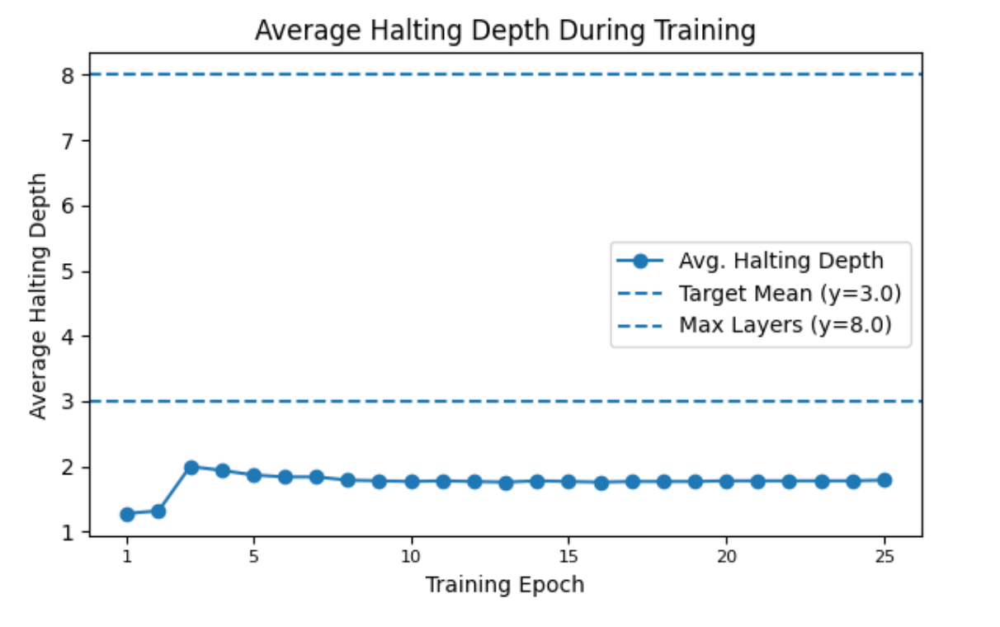

# Epsilon: A Transformer with Adaptive Computation and Quantized Attention

> **IMDb Accuracy: 90.07% | Speedup: ~1.5× | Params: ~4% Fewer**

Epsilon is a novel Transformer architecture designed for high efficiency, training stability, and interpretability. It is built for sequence-classification tasks and is demonstrated on the IMDb dataset.

| Model               | Parameters | Best Val. Acc. (%) | Avg. Epoch Time (s) | Relative Speedup |
| :------------------ | ---------: | -----------------: | ------------------: | ---------------: |
| Vanilla Transformer |    386,186 |              85.08 |               ~60.4 |             1.0× |
| **Epsilon (Ours)**  | **369,184**|          **90.07** |           **~40.5** |        **~1.5×** |

## Whitepaper

For a deep dive into the mathematical foundations, stability proofs, and architectural design of Epsilon, **please read the full technical paper.**

**[--> Read the Full Epsilon Paper (PDF) <--](./Epsilon_Paper.pdf)**

## The Core Idea

The standard Transformer's O(n²) complexity is a major bottleneck for long sequences. Epsilon solves this by synthesizing two key principles:

1.  **Adaptive Computation:** A single, recurrent `EpsilonBlock` allows each token to dynamically exit the computation once its representation has stabilized, drastically reducing the average computational depth.
2.  **Efficient Attention:** A novel **Histogram Quantized Scalar Attention (HQSA)** mechanism reduces complexity from O(n²) to a more scalable O(n·B) by having queries attend to a small number of aggregated feature "bins" instead of every other token.

This efficiency is driven by the model learning to solve tasks with a fraction of its potential computational depth, as shown below:



---

## Key Features

- **Adaptive Computation Halting:** Allows each token to use a variable amount of computation, saving significant resources.
- **Histogram Quantized Scalar Attention (HQSA):** A sub-quadratic attention mechanism for efficient processing of long sequences.
- **Advanced Stability Controls:** Includes `CenterNorm`, spectral normalization, and residual scaling (`α_res`) to ensure stable training of the recurrent block.
- **Rich Diagnostics & Interpretability:** Built-in tools to track halting depths, bin utilization, calibration error (ECE), and Jacobian spectral norms.
- **High-Performance Training:** Scripts support `torch.compile`, Automatic Mixed Precision (AMP), and include a strong Transformer baseline for fair comparison.

---

## Project Structure

```text
.
├── Epsilon_Paper.pdf         # The official whitepaper
├── train.py                  # Main script to train the Epsilon Transformer
├── model.py                  # Top-level EpsilonTransformer model
├── epsilon_block.py          # Core recursive block with halting
├── components.py             # Architectural components (HQSA, CenterNorm)
├── diagnostics.py            # Advanced functions for model analysis
├── interpretability_utils.py # Utilities for logging diagnostic data
├── data_utils.py             # IMDb data loading & preprocessing
├── vanilla_baseline.py       # Standard Transformer baseline
├── requirements.txt          # Python dependencies
└── README.md                 # This file
```

---

## Setup

1. Clone the repository:
   ```bash
   git clone https://github.com/mescuwa/epsilon.git
   cd epsilon
   ```
2. Install the required dependencies (a virtual environment is recommended):
   ```bash
   pip install -r requirements.txt
   ```

---

## Reproducing the Paper's Results

To replicate the main results from the paper, use the following commands.

> **Note on the Hyperparameters:** The model's parameters are intentionally and unconventionally small (e.g., `d_model=12`, `ffn_dim=72`). This *hyper-micro* configuration is a key part of the research, demonstrating the extreme parameter efficiency and architectural strength of the Epsilon model.

### Training the Epsilon Model

This command will train the Epsilon model and should reproduce the ~90.07% validation accuracy.

```bash
python train.py \
    --d_model 12 \
    --num_heads 2 \
    --ffn_dim 72 \
    --max_layers 8 \
    --num_bins 16 \
    --batch_size 32 \
    --learning_rate 3e-4 \
    --num_epochs 25 \
    --alpha_res 0.25 \
    --target_halting_mean 3.0 \
    --kl_loss_weight 0.015 \
    --ent_loss_weight 0.005 \
    --output_dir ./epsilon_paper_run \
    --use_amp \
    --use_cosine_scheduler \
    --warmup_steps 300 \
    --log_stats
```

### Training the Vanilla Baseline

This command trains the baseline model used for comparison in the paper.

```bash
python vanilla_baseline.py \
    --d_model 12 \
    --num_heads 2 \
    --ffn_dim 72 \
    --num_layers 8 \
    --batch_size 32 \
    --lr 3e-4 \
    --num_epochs 25 \
    --cosine
```

---

## License and Citation

Epsilon is distributed under the PolyForm-Noncommercial-1.0.0 license. You may use, copy, modify, and distribute this software for non-commercial purposes only (e.g., personal study, academic research). Commercial use is strictly prohibited.

### Citation

If you use Epsilon or its ideas in your research, please cite the project:

```bibtex
@misc{mescuwa2025epsilon,
  author       = {Mescuwa, Lumina},
  title        = {Epsilon: A Transformer with Adaptive Computation and Quantized Attention},
  year         = {2025},
  publisher    = {GitHub},
  journal      = {GitHub repository},
  howpublished = {\url{https://github.com/mescuwa/epsilon}}
}
```

---